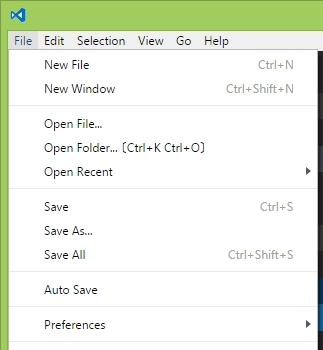
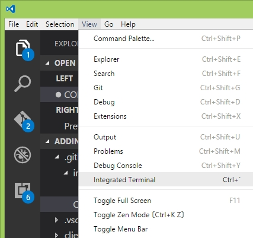
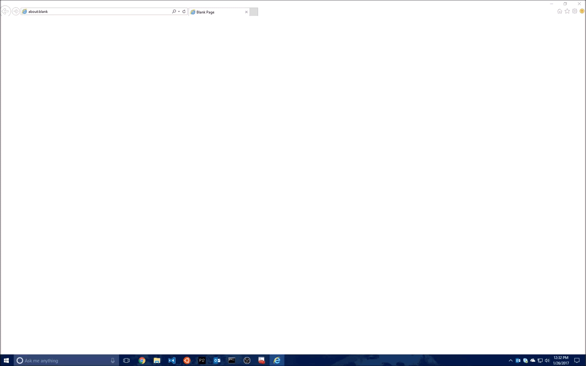

# Contributing

There are several ways in which you can contribute to the project:

1. **Log bugs or file feature suggestions**. To do this, simply file the bugs/suggestions in the Issues tab on GitHub for this project.
2. **Code samples**.  To suggest edits to existing samples, or to suggest your own, please submit a pull request against the Samples repo: **<https://github.com/OfficeDev/office-js-snippets>**.
3. **Translations**.  In addition to English, we now support German, courtesy of a community member who liked Script Lab so much that he decided to translate it into his native language (and blazed the way for how to do translations in general)!  Translating to other languages should now be pretty simple.  Please see "[TRANSLATING.md](TRANSLATING.md)" for more details.
4. **Bug-fix/feature contributions**.  If you have features or bug fixes that you'd like to see incorporated into the playground, just send us your pull request!

# Running the playground from source

## Prereq:

* Download & Install Visual Studio Code.  <https://code.visualstudio.com/>.  If you don't have a recent version, please update to latest (1.11 at time of writing)
  * I would also recommend installing the `TSLint` extension, which adds lint warnings straight into the editor.
* Download & install Node, version 6.9+.  In our experience, the LTS version of 6.10 and 6.11 works, whereas 8.1.2 did not, so mileage may vary. <https://nodejs.org/en>.
* Download & install Yarn, for use as an alternative for `npm install`.  Download from  <https://yarnpkg.com/en/docs/install>.  The documentation also describes why Yarn is preferable to `npm install`.
* Install `nodemon` for global use, using
~~~
    yarn global add nodemon
~~~

Note: the installation of Node JS and Yarn add paths to your operating system's PATH variable. Therefore, in some cases you may log off and log in from your System to get Node JS and Yarn work withing Visual Studio Code.

## Build steps:

1. Clone the repo
2. Open the root of the repository with VS Code.  (**File --> Open Folder...**)   

3. Open the terminal from within VS Code (**View --> Integrated Terminal**)   

4. In the terminal, type in `yarn install` and wait for all of the packages to be downloaded (this may take a few minutes).  The command prompt will return the control back to you once it's done.

5.	Run `npm start` in the terminal (or `ctrl+shift+b` and select `start` in the dropdown).  The process may pause for a few seconds, and you may see messages like "compilation complete"; but don't believe it!  You'll know that it's finally done when the web browser launches to https://localhost:3000, and when you see the following appear in the terminal:

~~~
[BS] Proxying: https://localhost:3100
[BS] Access URLs:
 --------------------------------------
       Local: https://localhost:3000
    External: https://10.82.217.77:3000
 --------------------------------------
          UI: http://localhost:3001
 UI External: http://10.82.217.77:3001
 --------------------------------------
~~~

6. **Importantly**, *once the `npm start` has completed and you see the message above*, **start the runner (server) by pressing `F5` within VS Code**.  Failure to do this will cause the "run" button to lead to an error (since the server, which is where the "run" code is running, is offline).  Ditto for auth, export, and other scenarios.

>>> NOTE: If you get an error that `nodemon` is not installed, be sure that you've installed it globally `yarn global add nodemon`, and that Node is part of your path.  

7.	Trust the certificates for both <https://localhost:3000>, <https://localhost:3100>, and <https://localhost:3200>.  For purposes of running add-ins on a PC, do this within Internet Explorer. See the gif below for a step-by-step animation:

.

The website is now running.  To try it out in an Add-in, see the next section.

> Note:  To **stop debugging**, first press the "stop" button on the debugger (shift + F5). You will see an error on the server terminal window (`[nodemon] app crashed - waiting for file changes before starting...`); that's ok, just close that terminal instance (trash icon on top-right of terminal).  If you want to restart debugging later, just re-press F5 again.

## Testing inside of an add-in

1. Locate the add-in manifest (which you'll find in the `manifests` folder in the root of the repo).  For purposes of running against localhost, use `script-lab-local.xml`.

2. Sideload the manifest into your office host application.  See <https://aka.ms/sideload-addins>, which includes instructions and a step-by-step video for sideloading on the desktop, as well as links for the other platforms.

## General structure

The project consists of two separate components: the client (editor) and the server (runner).  When run -- both on a dev machine, and in production -- they run on two separate URLs.  That way, a running snippet can never get the localStorage data (snippets, auth tokens, etc.) of the actual playground.

At the root level of the repo, the folders of interest (and skipping over the others) are:

* `client`: This is the playground editor UI.
* `config`: Configuration related to webpack & deployment
* `dist`: The generated files for `client` and `server` (it has subfolders for each), which are the compiled and minified html/js/css/etc. (TODO: Add why generate and check in, and which commands generate these files)
* `manifests`: Add-in manifests (both localhost and production) for side-loading the Add-in into Office applications.
* `node_modules`: The folder with all the node module dependencies that get installed as part of `yarn install`.
* `server`: A stateless Node backend that receives a POST request with the snippet's HTML, TypeScript, CSS, and Libraries, and creates a web-browser-servable web page out of them. The server makes extensive use of [Handlebars.js](http://handlebarsjs.com/) for templates, which are located in the `server/templates` directory.
* `typings`: Type definitions for a few of the libraries.

There are also files related to Azure deployment, git ignores, a Travis configuration for continuous-integration, a package.json with the project's metadata, TypeScript configuration files for client and server, a linter configuration, and etc.  And of course, the project's README.

## Enabling auth for local testing (optional, if debugging auth-related code)
1. Go to <https://github.com/settings/developers>, and click "[Register new application](https://github.com/settings/applications/new)" if you haven't done it before for your own dev copy of ScriptLab.
2. Give it a name like "ScriptLab Local Dev", with a Homepage and Auth callback URL of `https://localhost:3000`.
3. In `config/env.config.js`, find the `const config = { ... ` line, and under `local: { ...`, find `clientId: ''`, and replace with `clientId: '<id-from-github>'`.
4. In `server/server.ts`, find `client_secret: secrets ? secrets[env] : '',`, and replace it with `secrets ? secrets[env] : '<client-secret-from-github>'`.
5. If the site is running, re-start it and do a new `npm start`.  Incremental compilation is not enough for these changes. Note, too, that you need both the site and the server (F5) running to make auth work.
6. Once you are done with your testing, **be sure to undo both changes!**.

# Manual-testing scenarios

Please see "[TESTING.md](TESTING.md)".

# Tips & tricks

* There are two `package.json` files, one at the global level (for the client), and one inside of `src\server`. This can lead to differences in behavior between `localhost` and the deployed site, so be careful (e.g., if add one dependency in one place that should be shared, add it in both!). Their version numbers should also be bumped in synchrony.
* On IE, `console.log` in the runner won't display anything in FirebugLite **if F12 tools are open**.  It works fine if they're closed.
