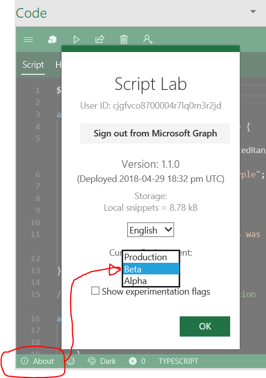

# Custom Functions Dogfood

## Setup

### Prereq: Ensure you have the "DevMain Channel (Dogfood)"

Ensure that you are on **DevMain Channel (Dogfood)**, with build number **9325 or greater** (we're already into the 5-digit numbers now, so for most of you, that should already be the case). Note that for purposes of these instructions and the //build timeline, Script Lab will only support Custom Functions **on Windows Desktop**.


### Step 1: Remove the existing Store version of Script Lab

If you already have Script Lab in your ribbon, please uninstall the Store version, so that you can sideload a custom-function-compatible version.


### Step 2: Sideload Manifest

The new manifest to sideload can be found [here](https://raw.githubusercontent.com/OfficeDev/script-lab/master/manifests/script-lab-prod.xml).

If you've not sideloaded before via a network share, please refer to the [official documentation](https://docs.microsoft.com/en-us/office/dev/add-ins/testing/create-a-network-shared-folder-catalog-for-task-pane-and-content-add-ins).

### Step 3: Switch to **BETA**

For now, the Custom Functions experience is only available in the **Beta** deployment of Script lab. So, in addition to sideloading the manifest (which is orthogonal to this step), you also need to switch to Beta (**Code editor ==> About ==> Environment: Beta**).



## A picture is worth a thousand recalcs


Custom Functions in action. Note the console.logs in the dashboard, as well!

## Usage

1.  Open the `Code` taskpane (via the Ribbon), create a new snippet, and replace the existing code with the following:

```typescript
/** @CustomFunction */
function sum(a: number, b: number): number {
  return a + b;
}
```

2.  Now choose the `Functions` ribbon button, to open the Custom Function dashboard appear. In a few seconds, the "Summary" tab should list the functions that you've registered.

3.  Enter `=SCRIPTLAB.{FULLFUNCTIONNAME}` into a cell within Excel (e.g., `=SCRIPTLAB.BLANKSNIPPET.ADD(5,7)`). Within moments, the result should appear right within the cell.

To try a more complicated (e.g., a web-service-calling) Custom Function, [import](http://aka.ms/scriptlab/import) this GitHub Gist: <https://gist.github.com/c8bbf1dd5c7fb33d5ea262e83e7df399>. Be sure to click "Trust" after importing.

## Friendly advice:

1.  Remember to add `/** @CustomFunction */` to any function you want registered.

1.  If you want to use `console.log`, do! It will show up in the "Console" tab of the Custom Functions dashboard.

1.  If you close and and re-open Excel, remember to re-register your custom functions.

## Troubleshooting

If for any reason your functions turn into `#GETTING_DATA` indefinitely, restart Excel. Hopefully this shouldn't be happening too often.

## Known issues

### Platform

1.  If you enter a Custom Function into a formula and then remove the function -- or if you restart Excel and before you re-register the custom functions -- the formula bar will show something like `=_xldudf_96323233322223(...)`
2.  Sometimes, you might get into a `#GETTING_DATA` state. This might be a platform bug, Michael is investigating...

### Script Lab

No known issues at the moment, but only tested on Windows for now.
