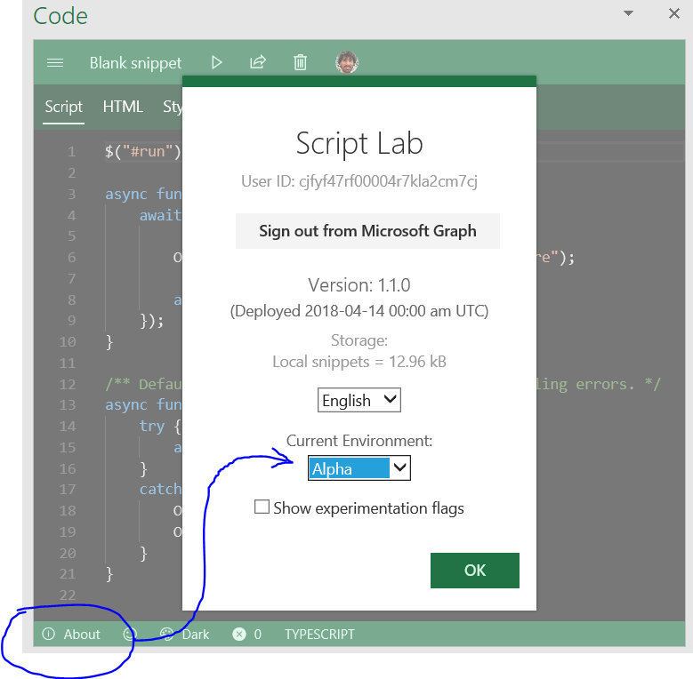
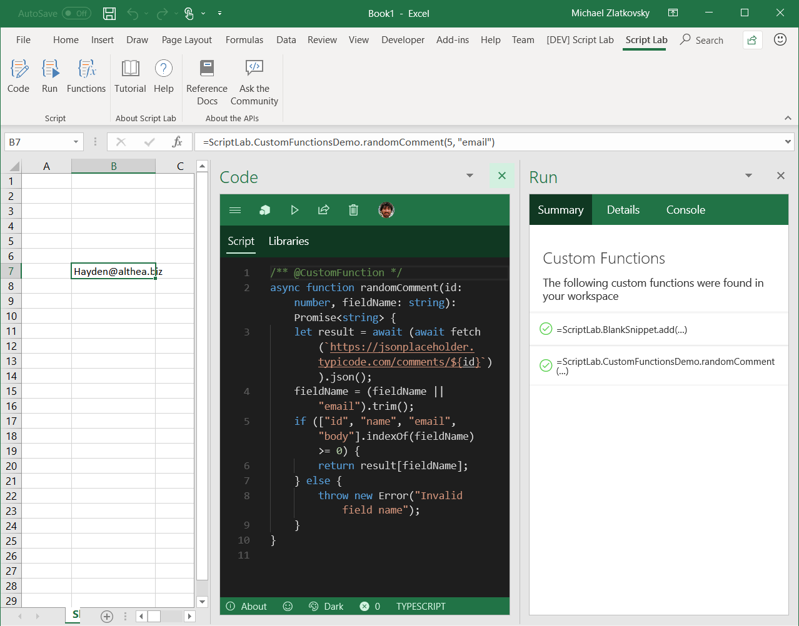

# Custom Functions Dogfood

## Setup

### Step 1: Remove the Store version of Script Lab
If you alredy have Script Lab in your ribbon, please remove it now, so that you can sideload a custom-function-compatible copy.


### Step 2: Sideload Manifest
Instructions on how to sideload a manifest can be found [here](https://docs.microsoft.com/en-us/office/dev/add-ins/testing/create-a-network-shared-folder-catalog-for-task-pane-and-content-add-ins).

The manifest to sideload can be found [here](https://raw.githubusercontent.com/OfficeDev/script-lab/master/manifests/script-lab-prod.xml).

### Step 3: Switch to Alpha
For now, the experience is only available in the Alpha branch of Script lab.  So, in addition to sideloading the manifest (that's orthogonal), you also need to switch to Alpha (Code editor ==> About ==> Environment: Alpha)




## A picture is worth a thousand recalcs


Custom Functions in action. Note the console.logs in the dashboard, as well!


## Usage

Note: For the following steps, if you feel lost, scroll down and peak at the screenshot to see the final result.

Open the `Code` and `Functions` taskpanes, via the Ribbon.

In the code editor, create a new snippet, and replace the existing code with the following:

```typescript
/** @CustomFunction */
function sum(a: number, b: number): number {
    return a + b;
}
```

If you want, you can also specify the function description and parameter descriptions in the JSDOC.  **BUT**, no matter what, you must include the **`@CustomFunction`** somewhere in the JSDOC (i.e., inside of a `/** ... */` block -- the double-star is important!)

```typescript
/**
* Adds two numbers
* @param a - First number to add
* @param b - Second number to add
* @CustomFunction
*/
function sum(a: number, b: number): number {
    return a + b;
}
```

To try a web-service Custom Function, [import](http://aka.ms/scriptlab/import) this GitHub Gist: <https://gist.github.com/c8bbf1dd5c7fb33d5ea262e83e7df399>. Be sure to click "Trust" after importing.


## Friendly advice:

1. Remember to add `/** @CustomFunction */` to any function you want registered.

1. If you want to use `console.log`, do!  It will show up in the Custom Functions dashboard taskpane.

1. **DO NOT CLOSE ANY OF THE PANES AFTER OPENING.**
There is currently a bug that will cause the custom functions runner to die if any of the panes are closed.

1. If you close and and re-open Excel, remember to re-register your custom functions.


## Troubleshooting
If for any reason your functions turn into `#GETTING_DATA` indefinitely, restart Excel.

## Known issues

### Platform

1. If you close any Script Lab taskpane, the custom function runner may die and you'll need to restart Excel
2. If you enter a Custom Function into a formula and then remove the function -- or if you restart Excel and before you re-register the custom functions -- the formula bar will show something like `=_xldudf_96323233322223(...)`

### Script Lab
At the moment, the experience should be functional but not polished.  We will be working with a designer to polish it soon.


