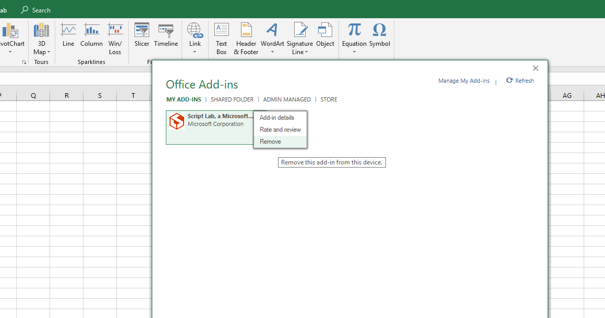

# Custom Functions Dogfood

## Setup

### Step 1: Remove the Store version of Script Lab
If you alredy have Script Lab in your ribbon, please remove it now, so that you can sideload a custom-function-compatible copy.


### Step 2: Sideload Manifest
Instructions on how to sideload a manifest can be found [here](https://docs.microsoft.com/en-us/office/dev/add-ins/testing/create-a-network-shared-folder-catalog-for-task-pane-and-content-add-ins).

The manifest to sideload can be found [here](https://raw.githubusercontent.com/OfficeDev/script-lab/master/manifests/script-lab-prod.xml).

## Usage

Open the `Code` and `Functions` panes.

Create a new snippet, and replace the existing code with the following:

```typescript
/**
* Adds two numbers
* @param a - First number to add
* @param b - Second number to add
* @CustomFunction
*/
function sum(a: number, b: number): number {
    return a + b;
}
```

## Friendly advice:

1. **DO NOT CLOSE ANY OF THE PANES AFTER OPENING.**
There is currently a bug that will cause the custom functions runner to die if any of the panes are closed.

2. **IF YOU CLOSE AND RE-OPEN EXCEL, YOU WILL NEED TO RE-REGISTER YOUR CUSTOM FUNCTIONS**

## Troubleshooting
If for any reason your functions turn into `#GETTING_DATA` indefinitely, restart Excel.

## Known issues

### Platform

1. If you close any Script Lab taskpane, the custom function runner may die and you'll need to restart Excel
2. If you enter a Custom Function into a formula and then remove the function -- or if you restart Excel and before you re-register the custom functions -- the formula bar will show something like `=_xldudf_96323233322223(...)`

### Script Lab
At the moment, the experience should be functional but not polished.  We will be working with a designer to polish it soon.


