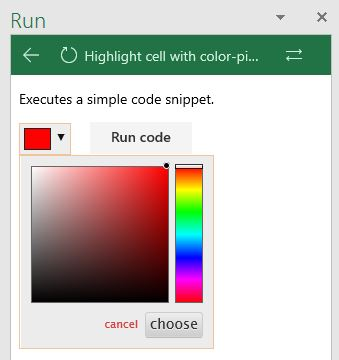
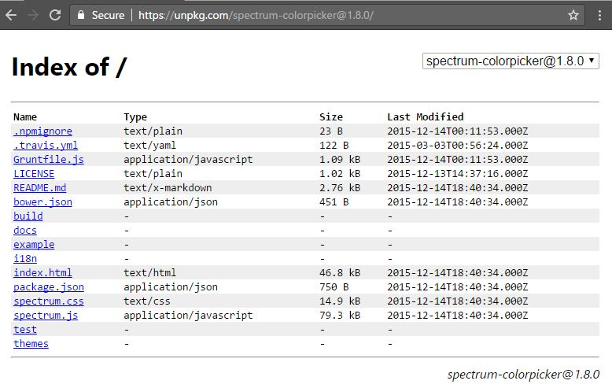

# Script Lab, a Microsoft Garage project
Experiment with the Office JavaScript API without ever leaving Excel, Word, PowerPoint, or Project! Free, from the [Office Store](https://store.office.com/app.aspx?assetid=WA104380862).

## Topics
* [What is Script Lab?](README.md#what-is)
* [Getting started](README.md/#get-started) 
* [Using Script Lab with older Office versions](README.md/#office-2013)
* [Staying up-to-date](README.md/#up-to-date)
* [Reporting a bug / suggesting a feature](README.md#report-bug)
* [Rating and reviewing](README.md#rate-and-review)
* [Contributing code or samples to Script Lab](README.md#contribute)
* [Frequently Asked Questions (FAQs)](README.md#frequently-asked-questions)
    - [How can I import someone else's snippet?](README.md#import)
    - [How can I reference external libraries?](README.md#external-libraries)
    - [Can I get IntelliSense for the external libraries too?](README.md#intellisense)
* [Anything else?](README.md#anything-else)

## What is Script Lab?

Wouldn't it be crazy if you could launch Excel, click to open a small code window, and then instantly start writing and executing JavaScript that interacts with your spreadsheet?

Script lab is a tool for anyone who wants to learn about writing Office add-ins for Excel, Word, or PowerPoint, and Project. The focus is the Office JavaScript API, which is the technology you need for building Office Add-ins that run across platforms. Maybe you're an experienced Office developer and you want to quickly prototype a feature for your add-in. Or maybe you've never tried writing code for Office and you just want to play with a sample and tweak it to learn more. Either way, Script Lab is for you.
Script Lab has three main features:
* **Code** in a pane beside your spreadsheet. IntelliSense is there while you type so you can easily discover and use the Office JavaScript objects and methods. And if you don't want to start from scratch there are plenty of samples pre-installed with Script Lab. Your snippets can use any TypeScript features like arrow functions, template strings, and async/await. But it's not only script: your snippets can also use HTML, CSS, and references to external libraries and data on the web. Script Lab uses the Monaco editor, the same tech that powers VS Code, so it's beautiful and lightweight. 
* **Run** the code in another pane beside the editor. Execution can include logic, API calls to Office, UI in the pane, and even output to a console. Every time you make a code change you can refresh the editor and run the new version in seconds.
* **Share** your snippets through GitHub. If you create a snippet you'd like to share, you can use Script Lab to save it. Then send the link to someone else to try it and tweak it on their computer. The Import feature lets you load other people's snippets.

You can [install Script Lab right now for free from the Office Store](https://store.office.com/app.aspx?assetid=WA104380862)! It works for Excel, Word, and PowerPoint, and Project on Office 2013 and later, Office Online, and Office for Mac.

Script Lab is a Microsoft Garage project that began as a hackathon project. You can read our story on the [Garage website](https://www.microsoft.com/en-us/garage/project-details.aspx?project=script-lab)

## Getting started

The easiest way to try Script Lab is with the Tutorial file for Excel that walks you through the tool in a few steps. You can get it here on GitHub: [script-lab-tutorial.xlsx](https://github.com/OfficeDev/script-lab/blob/master/src/client/assets/documents/script-lab-tutorial.xlsx)

Alternatively, you can start from scratch and [install Script Lab from the Store](https://store.office.com/app.aspx?assetid=WA104380862).

## Using Script Lab with older Office versions (Office 2013)

Office 2013 has several limitations compared to more recent versions.

First, there are far fewer supported objects and methods in the JavaScript API for Office 2013. As a result, many snippets that work on later versions of Office will not run in Office 2013. In the **Samples** menu we have included certain samples specifically designed to use only capabilities that are available in Office 2013. Those samples are marked **(2013)** in the sample title.

Second, Office 2013 (and Office 2016 RTM, if you don't have an Office 365 subscription) does not support ribbon buttons for Script Lab. As a result, there's a different way to access the **Code** and **Run** functions:
* To **Code**, select the **INSERT** tab and choose **My Add-ins**, then insert Script Lab.
* To **Run** a snippet, click the small **Run** triangle icon at the top of the Script Lab code pane.

## Staying up-to-date
* Follow [@OfficeDev](https://twitter.com/OfficeDev) on Twitter
* Join our Office Developer program at [dev.office.com](https://dev.office.com/)

## Reporting a bug / suggesting a feature

To report a bug, [create a new issue](https://github.com/OfficeDev/script-lab/issues/new). Please provide as much detail as you can: tell us the operating system, the Office build number, and your browser (if you're using Office Online).

It can also help to provide your Script Lab User ID (we generate it randomly for each device and it stays assigned to you until you clear your browser cache). You can find this ID under the **About** section in the editor view:

If you have a suggestion for a feature, please feel free to file it under "issues" as well, and we will tag it appropriately.  The more detail, the better!  We also gladly accept pull requests... (see more at [CONTRIBUTING.md](CONTRIBUTING.md)).

Finally, if you have a **question**, please ask it on <https://stackoverflow.com> instead. Tag your questions with `office-js` and `scriptlab`.

## Contributing code or samples to Script Lab

To contribute to Script Lab itself, or to contribute sample code, please see [CONTRIBUTING.md](CONTRIBUTING.md).

## Frequently Asked Questions (FAQs)

### How can I import someone else's snippet?

Script Lab is built around sharing.  If someone gives you a URL to a GitHub GIST, simply open Script Lab, use the hamburger menu at the top left to see the menu, and choose "Import" category (either on the left or top, depending on the available screen space). Then, enter the URL of the GIST, and click the "Import" button at the bottom of the screen.  In just these few clicks, you will be able to view and run someone else's snippet!

### How can I reference external libraries?

One of the powerful things about Script Lab is the ability to incorporate other libraries with your snippets. This creates a bunch of fun and compelling scenarios (for example, see the color-picker example, which you can import using the GIST URL <https://gist.github.com/Zlatkovsky/c7ba602e8a107cfe5dd6c42ca41deac1>)

The ease of importing varies depending on how the external library was created. If you are not sure, start with the first option, and progress to the next one if it doesn't work for you

#### Easiest: library is hosted on a regular CDN, exposes a global variable, and/or is a UMD module

This is the "happy path".  Simply reference the library (both the JS and the CSS, if relevant) in the "Libraries" tab.

If the library is hosted on a CDN (much as `Office.js` is), you could reference it as a URL, as follows:

    https://appsforoffice.microsoft.com/lib/1/hosted/office.js

If the library is available as an NPM package, you can just reference it by name:

    spectrum-colorpicker/spectrum.js
    spectrum-colorpicker/spectrum.css

This will use <https://unpkg.com/>, a global CDN for NPM libraries, to substitute in the appropriate files. Thus, the above is equivalent to:

    https://unpkg.com/spectrum-colorpicker@1.8.0/spectrum.js
    https://unpkg.com/spectrum-colorpicker@1.8.0/spectrum.css

> Tip: To see the available files in a package, simply include a `/` after the package name, and you'll get a directory listing.  E.g., <https://unpkg.com/spectrum-colorpicker/>. It will also conveniently tell you the available version numbers, via a dropdown at the top right of the site:
>
> 

#### Moderate: NPM package is an AMD module, but the library is also available via a "dist" build

Suppose you add a reference to the library (say, the [javascript-qrcode](https://www.npmjs.com/package/javascript-qrcode) NPM package), but all you get is an error in the console:

    ["Script error",
     "https://unpkg.com/javascript-qrcode",
     0, 0, undefined]

In Internet Explorer (and hence on Add-ins on a PC version of Office), you don't get much more information than this -- but on a different platform (or Office Online on a different browser), you will see:

    ["Uncaught ReferenceError: module is not defined",
     "https://unpkg.com/javascript-qrcode@1.0.7",
     3302, 1, ReferenceError: module is not defined {}]

If you are lucky, even though the *NPM* package doesn't contain a web-ready version of the package, the web-compatible version may be available elsewhere.  In the case of this `javascript-qrcode` package, the [NPM entry](https://www.npmjs.com/package/javascript-qrcode) points to a GitHub repo, <https://github.com/siciarek/javascript-qrcode>. And the repo, in turn, has a "dist" folder (convention), along with exampe usage that also shows ``.

This is great news, as it means that a web-ready version of the library is available!  Just click on the "dist" folder, and find the file you want:  <https://github.com/siciarek/javascript-qrcode/blob/master/dist/qrcode.min.js>

Almost there!  To be consumed inside of Script Lab, we need the file to be served in *RAW* form, ***and*** with correct Content-Type headers.  To do this, use a service like [RawGit](https://rawgit.com) to transform the file for you, and give you a URL you can use directly.

In this case, pasting in the above URL into RawGit produces:

    https://cdn.rawgit.com/siciarek/javascript-qrcode/041ad555/dist/qrcode.min.js

Include this in your Libraries tab, and you're good to go!

#### Harder: NPM package is an AMD module (must be loaded with `require.js`), and is *not* available in "dist" form

Suppose you get the same error as in the previous section, but you can't find a dist version of a library that you want.  Let's take [tinygradient](https://github.com/mistic100/tinygradient) as one such example.  The GitHub documentation of tinygradient says that it is "Compatible with Require.js/AMD and NodeJS".  Let's use Require.js to load it.

In your libraries tab, add a reference to `require.js` and to its IntelliSense types (note that `require.js` itself should be loaded from a web-compatible CDN version, not its NPM package):

    https://cdnjs.cloudflare.com/ajax/libs/require.js/2.3.3/require.min.js
    @types/requirejs

Do **NOT** add the names of the actual libraries that you want to load. They will be loaded at runtime instead, see below.

Next, in the Script tab, at the top of the file:

1. Add a line `require.onError = console.error`.  This redirection is vital for seeing useful errors, don't forget it!

2. Add a `require.config` section with a `paths` dictionary, listing out the sources of the JS files, as well as a local alias that you want to give them.  **Importantly**, add the entire path to the JS file, *minus the actual `.js` suffix*.  Thus:

    require.config({
        paths: {
            "tinygradient": "https://unpkg.com/tinygradient@0.3.1/tinygradient.min",
        }
    });

3. Add the code that you want to use, *inside of a `require` block*:

    require(['tinygradient'], function (tinygradient) {
        var gradient = tinygradient('red', 'blue');
        console.log(gradient.rgb(10));
    });

If you're lucky, it will work right off the bat.  If you're slightly less lucky, you might still get a useful error that will help you fix the issue (which is why the `require.onError` line described in step #1 is so important!)

    Error: Script error for "tinycolor", needed by: tinygradient
    http://requirejs.org/docs/errors.html#scripterror {...}

This just means that you need to have required an additional library, tinycolor.  Again, find its location (with https://unpkg.com being the easiest way of procuring it), and add it to the config paths list (*again, remembering to omit just the `.js` part of the filename). Also include the library name in the array in the `require` statement.  When you patch up both bits, you will end up with the following:

    // At the top of the file:

    require.onError = console.error;
    require.config({
        paths: {
            "tinygradient": "https://unpkg.com/tinygradient@0.3.1/tinygradient.min",
            "tinycolor": "https://unpkg.com/tinycolor2@1.4.1/tinycolor"
        }
    });

    // Somewhere further down, when you're ready to use it (e.g., in button click handler):

    require(['tinygradient', 'tinycolor'],  function (tinygradient) {
        var gradient = tinygradient('red', 'blue');
        console.log(gradient.rgb(10));
    });

Note that by putting the dependency towards the end of the array (opposite of what you might expect), I don't need to add it to the function arguments (as JS functions are OK with accepting only a portion of the parameters passed to them). But if I wanted to have a reference to both libraries, I would simply expand the callback to be `function(tinygradient, tinycolor) { ... }`

#### Impossible: CommonJS library

If the above did not work for you, and/or the library is published in CommonJS format, you might not be able to use it with Script Lab (or any other normal webpage, without first running it through a command-like tool like [Browserify](https://browserify.org)).  Sorry about that!

### Can I get IntelliSense for the external libraries too?

If the library is available as an NPM package, there is a good chance that it's `d.ts` file (which drives IntelliSense) is available as part of the `@types` NPM repository.  The easiest way to check is to type `https://unpkg.com/@types/<library-name>/`, and see if anything comes up.  For example, for the `spectrum` library in the examples above, we can see that <https://unpkg.com/@types/spectrum/> resolves to a folder with an `index.d.ts` in it (*don't forget the trailing slash!*).  In this case, you can just add the following to your Libraries list, alongside the JS/CSS references:

    @types/spectrum

Much as with regular NPM packages, the above is equivalent to adding

    https://unpkg.com/@types/spectrum@1.5.28/index.d.ts

If the library, for whatever reason, is not available on @types, but you can find it on [DefinitelyTyped](https://github.com/DefinitelyTyped/DefinitelyTyped/), simply put in the link to it.  So, for example, the `@types/office-js` reference (which uses the `@types` packaging) could alternatively have been written out as a long URL to the *RAW* d.ts contents:

    https://raw.githubusercontent.com/DefinitelyTyped/DefinitelyTyped/master/types/office-js/index.d.ts

If there are no IntelliSense definitions for the library you're using, but you don't want to see the red squiggly lines, you can always assert the existence of the variables/interfaces in the Script tab instead. For example, the Office Fabric library does not currently offer its definition files; and so if you look at the "Fabric JS - Using form data" example in Word, you will see the following unobtrusive line at the bottom of the Script tab, to avoid the red squiggly-lines:

    // To avoid compile errors for the undeclared "fabric" object, declare it to the type-system here.
    declare var fabric;

### Anything else?
Anything you wanted to see here, but did not?  Please file an issue with your suggestion for better documentation (or better yet, submit a pull request).  Thanks!
