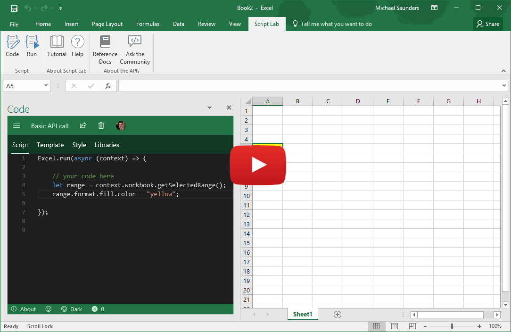
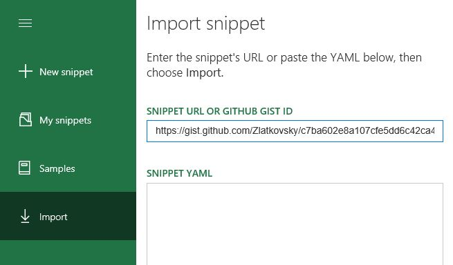
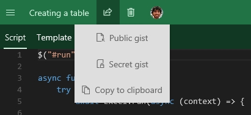
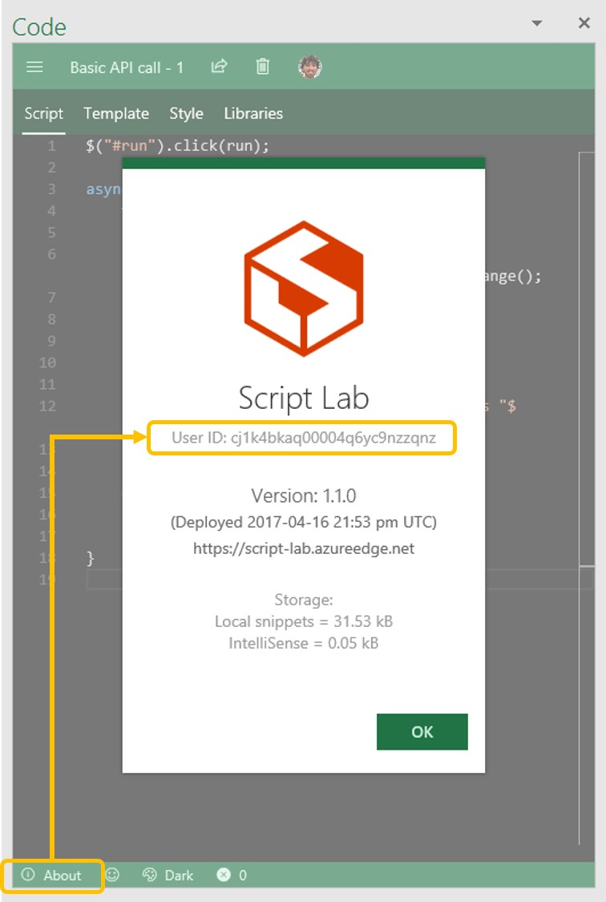

# Script Lab, a Microsoft Garage project
Experiment with the Office JavaScript API without ever leaving Excel, Word, PowerPoint, or Project! Free, from the [Office Store](https://store.office.com/app.aspx?assetid=WA104380862).

## Topics
* [What is Script Lab?](README.md#what-is)
* [External blog posts & media coverage](README.md/#external-posts)
* [How do I...](README.md/#how-do-i)
    - [Import someone else's snippet, or export my own?](README.md#import)
    - [Report a bug, or suggest a feature?](README.md#report-bug)
    - [Contribute to Script Lab?](README.md#contribute)
    - [Use Script Lab with older Office versions (Office 2013)?](README.md/#office-2013)
    - [Stay up-to-date?](README.md/#up-to-date)
    - [Rate and review?](README.md#rate-and-review)
* [Getting Started](README.md/#get-started)
* [Articles & FAQs](README.md/#articles)
* [Meet the Team](README.md/#meet-the-team)

## What is Script Lab?

Wouldn't it be crazy if you could launch Excel, click to open a small code window, and then instantly start writing and executing JavaScript that interacts with your spreadsheet?

Script lab is a tool for anyone who wants to learn about writing Office add-ins for Excel, Word, or PowerPoint, and Project. The focus is the Office JavaScript API, which is the technology you need for building Office Add-ins that run across platforms. Maybe you're an experienced Office developer and you want to quickly prototype a feature for your add-in. Or maybe you've never tried writing code for Office and you just want to play with a sample and tweak it to learn more. Either way, Script Lab is for you.
Script Lab has three main features:
* **Code** in a pane beside your spreadsheet. IntelliSense is there while you type so you can easily discover and use the Office JavaScript objects and methods. And if you don't want to start from scratch there are plenty of samples pre-installed with Script Lab. Your snippets can use any TypeScript features like arrow functions, template strings, and async/await (i.e., a good chunk of ES6 and ES7 features). But it's not only script: your snippets can also use HTML, CSS, and references to external libraries and data on the web. Script Lab uses the Monaco editor, the same tech that powers VS Code, so it's beautiful and lightweight.
* **Run** the code in another pane beside the editor. Execution can include logic, API calls to Office, UI in the pane, and even output to a console. Every time you make a code change you can refresh the editor and run the new version in seconds.
* **Share** your snippets through GitHub. If you create a snippet you'd like to share, you can use Script Lab to save it. Then send the link to someone else to try it and tweak it on their computer. The Import feature lets you load other people's snippets.

You can [install Script Lab right now for free from the Office Store](https://store.office.com/app.aspx?assetid=WA104380862)! It works for Excel, Word, and PowerPoint, and Project on Office 2013 and later, Office Online, and Office for Mac.

Script Lab is a Microsoft Garage project that began as a hackathon project. You can read our story on the [Garage website](https://www.microsoft.com/en-us/garage/project-details.aspx?project=script-lab)

## Getting Started

The easiest way to try Script Lab is with the Tutorial file for Excel that walks you through the tool in a few steps. You can get it here on GitHub: [script-lab-tutorial.xlsx](https://github.com/OfficeDev/script-lab/blob/master/src/client/assets/documents/script-lab-tutorial.xlsx)

Alternatively, you can start from scratch and [install Script Lab from the Store](https://store.office.com/app.aspx?assetid=WA104380862).

## How do I...

### Import someone else's snippet, or export my own?

Script Lab is built around sharing.  If someone gives you a URL to a GitHub GIST, simply open Script Lab, use the hamburger menu at the top left to see the menu, and choose "Import" category (either on the left or top, depending on the available screen space). Then, enter the URL of the GIST, and click the "Import" button at the bottom of the screen.  In just these few clicks, you will be able to view and run someone else's snippet!

Conversely, to share *your* snippet with someone, choose the "Share" menu within a particular snippet. You can share as a public or private [GitHub Gist](https://help.github.com/articles/about-gists/), or you can copy the entire snippet metadata to the clipboard, and share it from there.

### Report a bug, or suggest a feature

To report a bug, [create a new issue](https://github.com/OfficeDev/script-lab/issues/new). Please provide as much detail as you can: tell us the operating system, the Office build number, and your browser (if you're using Office Online).

It can also help to provide your Script Lab User ID (we generate it randomly for each device and it stays assigned to you until you clear your browser cache). You can find this ID under the **About** section in the editor view:

If you have a suggestion for a feature, please feel free to file it under "issues" as well, and we will tag it appropriately.  The more detail, the better!  We also gladly accept pull requests... (see more at [CONTRIBUTING.md](CONTRIBUTING.md)).

Finally, if you have a **question**, please ask it on <https://stackoverflow.com> instead. Tag your questions with `office-js` and `scriptlab`.

### Contribute to Script Lab

There are a bunch of ways in which you can contribute to Script Lab:

* File bugs & suggestions (see more in "[Report a bug, or suggest a feature](README.md#report-bug)" above).
* Contribute new samples, or improve existing one. Please submit a pull request to the [office-js-snippets repo](https://github.com/OfficeDev/office-js-snippets); more info in the [README](https://github.com/OfficeDev/office-js-snippets/blob/master/README.md) of that repo.
* Spread the word!  Whether through writing a blog post (README.md#external-posts), recording a video, tweeting about us, or sharing snippets with colleagues or the [StackOverflow](https://stackoverflow.com/questions/tagged/office-js) community -- we want more of the world to use Script Lab!
* Help improve the documentation. If you feel like this README or the [CONTRIBUTING.md doc](CONTRIBUTING.md) could use more details, please send a pull request!

Finally, if you want to contribute code (bug fixes, features, localization, etc.), please see [CONTRIBUTING.md](CONTRIBUTING.md) to get you up and running with a local copy of Script Lab -- and then send us a pull request.

### Use Script Lab with older Office versions (Office 2013)
Office 2013 has several limitations compared to more recent versions.

First, there are far fewer supported objects and methods in the JavaScript API for Office 2013. As a result, many snippets that work on later versions of Office will not run in Office 2013. In the **Samples** menu we have included certain samples specifically designed to use only capabilities that are available in Office 2013. Those samples are marked **(2013)** in the sample title.

Second, Office 2013 (and Office 2016 RTM, if you don't have an Office 365 subscription) does not support ribbon buttons for Script Lab. As a result, there's a different way to access the **Code** and **Run** functions:
* To **Code**, select the **INSERT** tab and choose **My Add-ins**, then insert Script Lab.
* To **Run** a snippet, click the small **Run** triangle icon at the top of the Script Lab code pane.

### Stay up-to-date
* Follow [@OfficeDev](https://twitter.com/OfficeDev) on Twitter
* Follow [Script Lab](https://medium.com/script-lab) articles on [medium.com](https://medium.com/script-lab)
* Join our Office Developer program at [dev.office.com](https://dev.office.com/)

### Rate and review

Leave a star-rating and (optionally) a review blurb for Script Lab on the [Office Store review page](https://store.office.com/writereview.aspx?assetid=WA104380862).

Of course, we'd prefer that if you have issues you [report them on GitHub](https://github.com/OfficeDev/script-lab/issues/new) instead, but you're free to leave any review comments you wish.

## Articles & FAQs

* Script Lab overview: ["You can write JavaScript in Excel!"](https://medium.com/script-lab/you-can-write-javascript-in-excel-4ba588a948bd)
* Project history & the technology behind it: [Episode 127 on the Office 365 Developer Podcast](https://blogs.office.com/2017/04/20/episode-127-new-script-lab-office-add-michael-zlatkovsky-bhargav-krishna-office-365-developer-podcast/)

## External blog posts & media coverage

* May 1, 2017: *[German]* ["Prototyping von Microsoft Office JavaScript Add-Ins mit Script Lab"](http://www.excel-ticker.de/prototyping-von-microsoft-office-javascript-add-ins-mit-script-lab/).  (Auto-translation: ["Prototyping Microsoft Office JavaScript add-ins with Script Lab"](http://www.microsofttranslator.com/bv.aspx?&lo=TP&from=de&to=en&a=http%3A%2F%2Fwww.excel-ticker.de%2Fprototyping-von-microsoft-office-javascript-add-ins-mit-script-lab%2F).  *Written by [Mourad Louha](https://twitter.com/maninweb)*.

## Meet the Team

Script Lab, a Microsoft Garage project, is brought to you by this fabulous group of well-dressed geeks:

Michael Zlatkovsky, Bhargav Krishna, Jakob Nielsen, Michael Saunders, and Daniel M. Galan.

