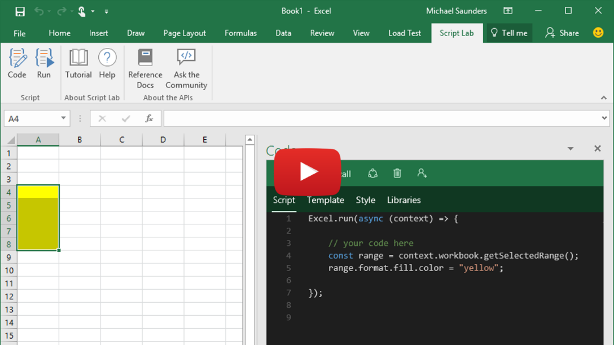

# Script Lab, a Microsoft Garage project
Experiment with the Office JavaScript API without ever leaving Excel, Word, PowerPoint, or Project! Free, from the [Office Store](https://store.office.com/app.aspx?assetid=WA104380862).

## Topics
* [What is Script Lab?](README.md#what-is)
* How do I...
    - [Get started?](README.md/#get-started) 
    - [Stay up-to-date?](README.md/#up-to-date)
    - [Report a bug?](README.md#report-bug)
    - [Contribute code to Script Lab?](README.md#contribute)

## What is Script Lab?

Wouldn’t it be crazy if you could launch Excel, click to open a small code window, and then instantly start writing and executing JavaScript that interacts with your spreadsheet?

Script lab is a tool for anyone who wants to learn about writing Office add-ins for Excel, Word, or PowerPoint, and Project. The focus is the Office JavaScript API, which is the technology you need for building Office Add-ins that run across platforms. Maybe you’re an experienced Office developer and you want to quickly prototype a feature for your add-in. Or maybe you’ve never tried writing code for Office and you just want to play with a sample and tweak it to learn more. Either way, Script Lab is for you.
Script Lab has three main features:
* **Code** in a pane beside your spreadsheet. IntelliSense is there while you type so you can easily discover and use the Office JavaScript objects and methods. And if you don’t want to start from scratch there are plenty of samples preinstalled with Script Lab. Your snippets can use any TypeScript features like arrow functions, template strings, and async/await. But it’s not only script: your snippets can also use HTML, CSS, and references to external libraries and data on the web. Script Lab uses the Monaco editor, the same tech that powers VS Code, so it’s beautiful and lightweight. 
* **Run** the code in another pane beside the editor. Execution can include logic, API calls to Office, UI in the pane, and even output to a console. Every time you make a code change you can refresh the editor and run the new version in seconds.
* **Share** your snippets through GitHub. If you create a snippet you’d like to share, you can use Script Lab to save it. Then send the link to someone else to try it and tweak it on their computer. The Import feature lets you load other people’s snippets.

You can [install Script Lab right now for free from the Office Store](https://store.office.com/app.aspx?assetid=WA104380862)! It works for Excel, Word, and PowerPoint, and Project on Office 2013 and later, Office Online, and Office for Mac.

Script Lab is a Microsoft Garage project that began as a hackathon project. You can read our story on the [Garage website](https://www.microsoft.com/en-us/garage/project-details.aspx?project=script-lab)

## Get Started

The easiest way to try Script Lab is with the Tutorial file for Excel that walks you through the tool in a few steps. You can get it here on GitHub: [script-lab-tutorial.xlsx](https://github.com/OfficeDev/script-lab/blob/master/src/client/assets/documents/script-lab-tutorial.xlsx)

## Stay up-to-date
* Follow [@OfficeDev](https://twitter.com/OfficeDev) on Twitter
* Join our Office Developer program at [dev.office.com](https://dev.office.com/)

## Report a bug
To report a bug, [create a new issue](https://github.com/OfficeDev/script-lab/issues/new). Please provide as much detail as you can: tell us the operating system, the Office build number, and your browser (if you're using Office Online).

It can also help to provide your Script Lab User ID (we generate it randomly for each device and it stays assigned to you until you clear your browser cache). You can find this ID under the **About** section in the editor view:

If you have a question, ask it on <https://stackoverflow.com> instead. Tag your questions with `office-js` and `scriptlab`.

## Contribute code or samples to Script Lab

To contribute to Script Lab itself, or to contribute sample code, please see [CONTRIBUTING.md](CONTRIBUTING.md).
