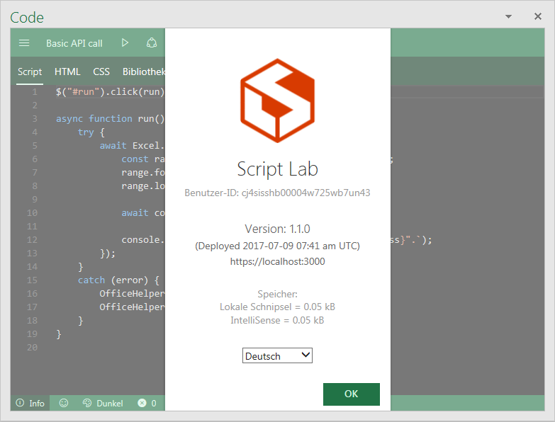

# Translate Script Lab to other languages

This document describes how to create a new translation for Script Lab or improve an existing translation.

## Topics
* [Prerequisites](TRANSLATING.md#prerequisites)
* [Understanding the Script Lab structure for translating](TRANSLATING.md#structure)
* [Create a new translation](TRANSLATING.md/#create)
* [Improve an existing translation](TRANSLATING.md#improve)
* [Testing your translation](TRANSLATING.md#testing)
* [Script Lab languages](TRANSLATING.md/#translations)

<a id="prerequisites"></a>
## Prerequisites

[Fork](https://help.github.com/articles/about-forks/) this project into your GitHub account and [create a branch](https://help.github.com/articles/creating-and-deleting-branches-within-your-repository/) for your translation work, which you will later use for sending a [pull request](https://help.github.com/articles/about-pull-requests/) to this repository. Please note, that if you are not employed by Microsoft and you have not already signed the Microsoft Contribution License Agreement, you will be asked to sign the agreement before your pull request is accepted.

We recommend you to download and install Visual Studio Code from here <https://code.visualstudio.com/> and follow the instructions from here [CONTRIBUTING.md](CONTRIBUTING.md) for how to run the playground from source and having a local copy of the project. 

<a id="structure"></a>
## Understanding the Script Lab structure for translating

The Script Lab code is mainly composed of two parts: the server part and the client part. Each part has its own files to be modified and/or added for creating or improving a translation. Additionally, the project includes 4 manifest files which also include translatable strings.

### Server part files

Basically, the structure for the server files is represented by the following table. Each translation is stored in a separate file named to the corresponding language.

| Folder                   | Filename                  | Description                                    |
|:-------------------------|:--------------------------|:-----------------------------------------------|
| `src/server/strings`     | `index.ts`                | Contains code to load the strings.             |
| `src/server/strings`     | `english.ts`              | Contains the original strings in English.      |
| `src/server/strings`     | `german.ts`               | Contains the translated strings to German.     |
| `src/server/strings`     | :                         | More files, one per language.                  |

### Client part files

The structure for the client files is similar to the structure for the server files, but located in another folder. Each translation is stored in a separate file too.

| Folder                   | Filename                  | Description                                    |
|:-------------------------|:--------------------------|:-----------------------------------------------|
| `src/client/app/strings` | `index.ts`                | Contains code to load the strings.             |
| `src/client/app/strings` | `english.ts`              | Contains the original strings in English.      |
| `src/client/app/strings` | `german.ts`               | Contains the translated strings to German.     |
| `src/client/app/strings` | :                         | More files, one per language.                  |

### Manifest files

The Script Lab Project includes 4 manifest files referencing to different servers, e.g. for testing purposes. For each manifest file, the translations are included in different sections of the file. Adding or changing a translation implies to do this in all 4 files.

| Folder                   | Filename                  | Description                                    |
|:-------------------------|:--------------------------|:-----------------------------------------------|
| `manifests`              | `script-lab-edge.xml`     | Manifest for the edge version.                 |
| `manifests`              | `script-lab-insiders.xml` | Manifest for the insider version.              |
| `manifests`              | `script-lab-local.xml`    | Manifest for the locally installed version.    |
| `manifests`              | `script-lab-prod.xml`     | Manifest for the production version.           |

### Store metadata files

The Office Store requires additional metadata to be submitted alongside the manifest. For localization, all the files in `store_metadata/en-us` should be reproduced in a new folder under `store_metadata` for the new language being added. For example, create `store_metadata/fr-fr` for the French (France) locale.

| Folder                   | Filename                  | Description                                    |
|:-------------------------|:--------------------------|:-----------------------------------------------|
| `store_metadata/en-us`              | `long-description.txt`     | Description on the Office Store page. Max length is 2000 characters.                |
| `store_metadata/en-us`              | `screenshot1.png`    | Primary screenshot on the Office Store page. Dimension must be exactly 512 px by 384 px.    |
| `store_metadata/en-us`              | screenshots 2-5     | (optional) Secondary screenshots on the Office Store page. Dimension must be exactly 512 px by 384 px.           |

<a id="create"></a>
## Create a new translation

When creating a new translation, some steps must be done before you can start to translate.

The first step is to retrieve the official code for your language. You can refer to this list [Language identifiers and OptionState Id values in Office 2016](https://technet.microsoft.com/en-us/library/cc179219(v=office.16).aspx). You need the first two letters of the mentionned codes. For example, for German the code is `de`, for French `fr` and for Spanish `es`.

### Server part

Create a copy of the file `english.ts` from and to the folder `src/server/strings` and rename this copy to the language you are going to translate the strings. Please use the English name for your language. For example, if you are going to translate the strings into French, rename the file to `french.ts`. The filename must be in lower case letters.

Open the new file and change the word `English` of the function name `getEnglishStrings()` to the name of your language, where the first letter must be upper case. If we keep the example of creating a french translation, the function name would now be `getFrenchStrings()`.

Next step would be to tell the code, that a new language is available. For this, open the file `index.ts` in the server part folder `src/server/strings`. You will have to add two new lines to the code. If we keep our example for French again, the result will be similar to the code block shown below:

```ts
import { getEnglishStrings } from './english';
import { getGermanStrings } from './german';
import { getFrenchStrings } from './french';

const languageGenerator: { [key: string]: () => ServerStrings } = {
    'en': () => getEnglishStrings(),
    'de': () => getGermanStrings(),
    'fr': () => getFrenchStrings(),
    '??': () => createFakeStrings(() => getEnglishStrings())
};
```
In the code above, the new line `import { getFrenchStrings } from './french';` has been added to the already existing imports for English and German. And the second new code line `'fr': () => getFrenchStrings(),` has been added to the language generator.

That's all. Now you can start to translate your language file. Please note, that while most strings are just strings, others are functions that accept some parameters, and those parameters often get inlined into the return string using TypeScript template strings such as double quotes `"`. For these variables, which look like `${parameterName}`, the name inside of `${parameterName}` should be preserved as is.

The strings in the Script Lab TypeScript files are mostly enclosed by single quotes `'` or apostrophes. If you need to use the single quote character inside a string, you would normally have to escape this character. In TypeScript, there is an easy way to avoid the escaping problem by using the TypeScript template strings, even if you don't use any variables within them. Just replace the enclosing single quotes of the string by a backtick (or grave accent) character.

```ts
sampleString: `It's a wonderful "thing" that you don't have to escape anything anymore!`
```

### Client part

Creating a translation for the client part is very similar to the translation for the server part. 

Create a copy of the file `english.ts` from and to the folder `src/client/app/strings` and rename this copy to your language, like you did for the server part. Open the new file and rename the `getEnglishStrings()` to the same function name, you used in the server part. 

Then open the file `index.ts` in the client part folder `src/client/app/strings` and - in this case - add three lines of code. Keeping our example of adding a french translation, the code will look similar to the following code block:

```ts
import { getEnglishStrings } from './english';
import { getGermanStrings } from './german';
import { getFrenchStrings } from './french';

let availableLanguages = [
    { name: 'English', value: 'en' },
    { name: 'Deutsch', value: 'de' },
    { name: 'Français', value: 'fr' }
];

const languageGenerator: { [key: string]: () => ClientStrings } = {
    'en': () => getEnglishStrings(),
    'de': () => getGermanStrings(),
    'fr': () => getFrenchStrings(),
    '??': () => createFakeStrings(() => getEnglishStrings())
};
```

Like for the server part, the two lines `import { getFrenchStrings } from './french';` and `'fr': () => getFrenchStrings(),` have been added to the code. Additionally, the new line  `{ name: 'Français', value: 'fr' }` has been added after the last entry for the list of available languages. When adding your language to this list, please do not forget to add the comma at the end of previous line.

### Manifest part

The translations of strings within the manifest files are addressed by the XML tag `override` and an indication of the country code. So, for adding your translation, just duplicate a line from another translation, set your country code and update the text.

Allmost all translatable strings are located at the bottom of the XML files. An exception is the description of Script Lab, located on top of the XML file.

Here is an example, where the string *Help* has been translated to German and French.

```xml
  <bt:String id="PG.RunCommand.Title" DefaultValue="Help">
    <Override Locale="de" Value="Hilfe"/>
    <Override Locale="fr" Value="Aide"/>
  </bt:String>
```
The strings are enclosed by double quotes in the XML files. If you need to use the double quote character in your translation, please use the entity `&quot;` instead of the double quote character. If you need to use the ampersand character `&` in your translation, please use its entity `&amp;` instead.

### Store metadata part

Under `store_metadata`, create your locale folder. Translate the description from the `store_metadata/en-us` folder (the title and short description translations are also used for the submission, but they're already found in the manifest). Create at least one screenshot (512 px horizontal and 384 px vertical) that shows Script Lab being used inside Office in the new locale.

<a id="improve"></a>
## Improve an existing translation

If you would like to improve an existing translation, e.g. correct a typing error or suggest a better wording, then just open the corresponding existing language files and do your changes. For example, if you discovered an error in the translation to *German* for the *client part*, then open the file `german.ts` from the folder `src/client/app/strings` and do the change.

If you modify one or more translations within one of the manifest files, please do not forget to also do the change in the 3 other files.

<a id="testing"></a>
## Testing your translation

You should test your translations locally before sending a pull request to the original repository. Testing helps you to validate your translation and see how it looks in the application. And, for example, to see if texts are too long and should be shortened. For creating a testing environment, please refer to the instructions from here [CONTRIBUTING.md](CONTRIBUTING.md).

Script Lab recognizes the installed language of your Office App (Excel, Word, PowerPoint) and automatically selects a language. If this recognition fails, for what reason ever, Script Lab switches back to English. However, you can switch between languages by selecting the language in the About dialogue.



<a id="translations"></a>
## Script Lab languages

Script Lab is currently available or being translated into the following languages:

| Language           | Code   | Status             | Production         | Notes              |
|:-------------------|:-------|:-------------------|:-------------------|:-------------------|
| English            | en     | Complete           | Yes                | Default language   |
| German             | de     | Complete           | No                 | -                  |

